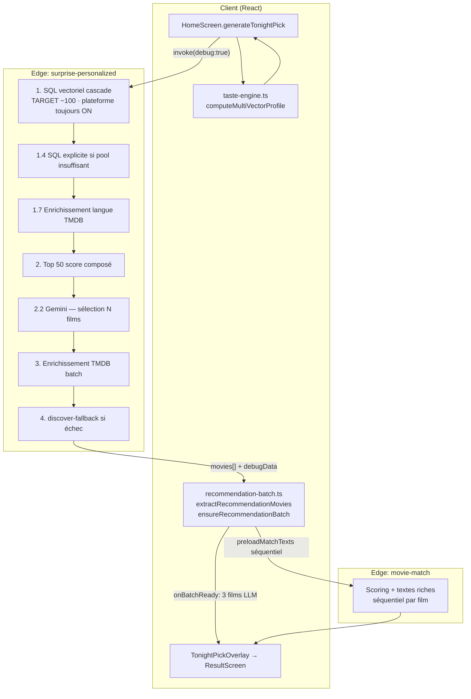

# Pipeline de recommandation — Pick Your Spotlight

> **Rôle** : moteur cœur de Pick — transforme le profil de goût d'un utilisateur en 1 à 5 films affichés sur l'écran d'accueil (« Ce soir »), avec textes personnalisés et score de match.  
> **Complète** : [architecture-recommandation.md](architecture-recommandation.md) (6 couches données → vecteurs) · ce document couvre le **parcours runtime** client → edge → UI.  
> **TNR** : voir [BACKLOG.md](BACKLOG.md) § TNR pipeline · [SMOKE_TESTS.md](SMOKE_TESTS.md) § 3.2.

---

## Vue d'ensemble

Le pipeline « surprise du soir » s'active quand l'utilisateur a **≥ 2 films likés** et un **vecteur de goût 32D** calculé. Sinon, un fallback TMDB léger (`getSurpriseRecommendation`) complète le batch côté client.

**Entrées principales** : profil (`tasteProfile`), vecteurs (`stable` / `recent` / `avoidance`), plateformes, genres exclus, `excludeIds` (historique + session), overrides voix / ambiance / duo.

**Sortie** : 3 films typiques (configurable via `recommendationCount`, défaut 5) avec affiche TMDB, `reason` LLM, score fusionné, textes riches `movie-match`.

---

## Diagramme end-to-end

---

## Étapes du pipeline

| # | Étape | Comptes typiques | Critères de sélection | Fichiers clés |
|---|--------|------------------|----------------------|---------------|
| **0** | Préparation client | `excludeIds` : 20–200+ | Feedback `user_item_feedback`, rejets session, pool chat, partenaire duo | `HomeScreen.tsx` · `use-recommendation-engine.ts` · [`taste-engine.ts`](../src/lib/taste-engine.ts) |
| **1** | SQL vectoriel 32D | Pool cible **~100** non-interagis ; debug `sql50` peut lister **tous** les bruts (souvent 100–176) | RPC `match_movies_for_recommendation` · similarité cosinus · **plateforme jamais levée** · cascade niveaux 0→3 (relâchement lang/année/genres/note) | [`surprise-personalized/index.ts`](../supabase/functions/surprise-personalized/index.ts) · migrations RPC |
| **1.4** | SQL explicite (sans vecteur) | Complète jusqu'à 100 si vecteur absent ou pool faible | `match_movies_explicit` · 3 niveaux (goût strict → plateforme seule) | idem SP |
| **1.7** | Enrichissement langue | Jusqu'à 60 candidats `original_language` null | Appels TMDB + backfill embeddings | idem SP |
| **2** | Top composite | **50** films (`llmPoolSize`) | `composite = sim×100 + note` (+ boost langue préférée +15) · post-filtres voix genre/décennie | idem SP |
| **2.2** | LLM Gemini | Entrée : jusqu'à 50 · Sortie : `count+2` (ex. **5** si count=3) | Prompt profil + liste numérotée · JSON `selections[{rank, matchScore, reason}]` · fallback déterministe si LLM KO | idem SP · `GOOGLE_AI_KEY` |
| **3** | TMDB enrichissement | 1 appel / sélection LLM | `getMovieDetails` · retry type movie/tv | idem SP · `tmdb-proxy` |
| **3.5** | Retry qualité | +N si &lt; 3 films ≥ `minMatchScore` | Complète depuis pool SQL restant · **`reason: null`** | idem SP |
| **4** | discover-fallback | 0–3 si SQL+LLM vides | Trending TMDB `with_watch_providers` | idem SP |
| **5** | Affichage immédiat UI | **3** films visibles (typ.) | `onBatchReady` : texte LLM (`reason`) sans attendre movie-match | [`recommendation-batch.ts`](../src/lib/recommendation-batch.ts) · `HomeScreen.tsx` |
| **6** | movie-match | 1 appel **séquentiel** / film affiché (+ réserve waterfall) | Embedding 32D + Gemini · textes `headline`, `whyItMatches` · fusion score SP/MM | [`movie-match/index.ts`](../supabase/functions/movie-match/index.ts) · `recommendation-batch.ts` |

Constantes serveur : `TARGET = 100`, `llmPoolSize = 50`, `BATCH = 500` par round SQL.

---

## Fichiers source — index rapide

| Composant | Chemin | Rôle |
|-----------|--------|------|
| Profil multi-vecteurs | [`src/lib/taste-engine.ts`](../src/lib/taste-engine.ts) | `computeMultiVectorProfile` — stable / récent / évitement · cache `user_taste_vectors` |
| Batch client | [`src/lib/recommendation-batch.ts`](../src/lib/recommendation-batch.ts) | Extraction payload SP · `ensureRecommendationBatch` · enrichissement MM + providers |
| Orchestration accueil | [`src/components/pick/HomeScreen.tsx`](../src/components/pick/HomeScreen.tsx) | `generateTonightPick` · logs `[PICK-DEBUG]` · `debug: true` |
| Orchestration wizard | [`src/pages/index/use-recommendation-engine.ts`](../src/pages/index/use-recommendation-engine.ts) | Flux `/app` guidé · même edge functions |
| Moteur edge principal | [`supabase/functions/surprise-personalized/index.ts`](../supabase/functions/surprise-personalized/index.ts) | SQL → LLM → TMDB → réponse |
| Textes & score final | [`supabase/functions/movie-match/index.ts`](../supabase/functions/movie-match/index.ts) | Personnalisation par film · score 55–99 % |
| TNR exclusions | [`src/test/recommendation-non-regression.test.ts`](../src/test/recommendation-non-regression.test.ts) | Invariant : jamais de film déjà interagi |
| E2E smoke | [`tests/e2e/pipeline.spec.ts`](../tests/e2e/pipeline.spec.ts) | Overlay + mocks edge (partiel) |

---

## Console debug — mapping `[PICK-DEBUG]`

Activé quand `debug: true` est envoyé à `surprise-personalized` (toujours en prod sur `HomeScreen`). Groupes dans l'ordre d'apparition :

| Groupe console | Champ `debugData` | Contenu |
|----------------|-------------------|---------|
| `📤 Paramètres envoyés` | — (client) | Vecteur, plateformes, genres, `excludeIds` |
| `1️⃣ SQL vectoriel 32D` | `sql50`, `sqlCascadeLevel`, `sqlRpcParams`, `sqlCountDiag`, `sqlSnippet` | Candidats SQL triés par Sim% · snippet RPC reproductible |
| `📈 Détail par niveau de cascade` | `sqlLevelDebug` | Films gagnés par niveau 0–3 |
| `1️⃣⁺ SQL explicite` | `explicitFallbackDebug` | Complément sans vecteur |
| `🧠 Profil utilisateur → LLM` | `llmProfile`, `systemPrompt` | Contexte LLM complet |
| `2️⃣ Top N envoyés au LLM` | `top20` ⚠️ | **Jusqu'à 50 films** (clé historique `top20`, voir quirks) |
| `2️⃣⁺ Plateformes` | `platformPool`, `llmFiltered` | Filtre plateforme (souvent bypass : plateforme déjà en SQL) |
| `3️⃣ Sélections LLM` | `llmSelections` | `matchScore` LLM + `reason` |
| `🔀 Films fallback` | `fallbackTrace` | Mode `discover-fallback` |
| `3️⃣.5 TMDB enrichissement` | `tmdbEnrichment` | OK / échec par ID |
| `4️⃣ Films finaux` (edge) | `finalMoviesList` | Sortie SP avant movie-match |
| `engineMeta` | `engineMeta` | Timings, `platformFallbackTriggered`, mode |
| `⏱️ Timings pipeline` | `engineMeta.timings` | SQL · lang · LLM · TMDB · fallback |
| `4️⃣ Résultat final après movie-match` | — (client) | Score MM · rich texts vs `FALLBACK` |

Préfixe perf client : `[Pick⏱]` (surprise-personalized, movie-match eager/lazy).

---

## Échelles de score (3 systèmes)

| Échelle | Où | Plage | Usage UI |
|---------|-----|-------|----------|
| **Sim%** | SQL / debug | ~0–100 (similarité × 100) | Tri candidats · tables debug |
| **Composite** | Pré-LLM | `sim×100 + note TMDB` | Top 50 avant Gemini |
| **LLM `matchScore`** | Sélections Gemini | 60–99 (prompt) | Teaser immédiat `onBatchReady` |
| **movie-match** | Client final | 55–99 (cap seuil profil à 55 côté MM) | Badge confiance · fusion `max(SP≥60, MM)` |

La fusion côté client (`recommendation-batch.ts`) ignore les scores SP &lt; 60 % comme aberrants et prend le meilleur entre SP valide et MM.

---

## Quirks connus (audit juin 2026)

| Quirk | Détail | Impact |
|-------|--------|--------|
| **`sql50` ≠ 50** | Contient **tous** les candidats du pool SQL (souvent ~100–176), pas 50 | Console « 176 candidats » vs attente « top 50 » — **métriques debug trompeuses** |
| **`top20` = top 50** | Clé debug `top20` remplie avec `llmPool` (max 50) ; libellé console « Top 20 » | Renommer en `top50` + libellés console (backlog **1.23**) |
| **`platformFallbackTriggered` mal nommé** | `true` dès **cascade SQL niveau ≥ 1** (relâchement contraintes goût), **pas** levée du filtre plateforme | Message « cascade appliquée, plateforme conservée » — le flag suggère une désactivation plateforme |
| **`reason: null`** | Fallback LLM déterministe · retry qualité · parsing JSON partiel | Colonne « Raison » vide dans tables debug ; UI garde parfois le teaser LLM initial |
| **Trois échelles** | Sim% · LLM · MM non comparables directement | Ne pas trier debug par Sim% en supposant l'ordre final |
| **`movie-match` FALLBACK** | Gemini KO → objet `{ fallback: true }` | Log client `⚠️ FALLBACK` · retry 4 s · films réserve |

---

## Prérequis & garde-fous

- **≥ 2 likes** : sinon fallback `getSurpriseRecommendation` (pas de SP).
- **Vecteur null** : SQL vectoriel sauté → SQL explicite ou discover-fallback.
- **Exclusions** : `excludeIds` + `usedIds` côté edge — TNR dans `recommendation-non-regression.test.ts`.
- **Plateforme** : toujours appliquée en SQL ; safety net client désactivé si plateformes sélectionnées.
- **Auth** : `surprise-personalized` et `movie-match` exigent JWT (`requireAuth`).

---

## Autres points d'entrée

| Contexte | Fichier | Variante |
|----------|---------|----------|
| Wizard `/app` (Index) | `use-recommendation-engine.ts` | Même SP · pas de `debug: true` par défaut |
| Révéler soirée | `HomeScreen` / `runRevealPipeline` | Overrides mood/genres/mediaType |
| Création événement | `CreateEventPage.tsx` | `count: 3` · pas de movie-match client |
| Duo | `HomeScreen` + `duoUserIds` | Vecteur fusionné · exclusions partenaire |

---

## Voir aussi

- [architecture-recommandation.md](architecture-recommandation.md) — couches données, `user_movie_scores`, cible taste-engine
- [BACKLOG.md](BACKLOG.md) — **1.19** tests unitaires · **TNR pipeline** (3 phases)
- [SMOKE_TESTS.md](SMOKE_TESTS.md) — checklist manuelle post-déploiement § 3.2
